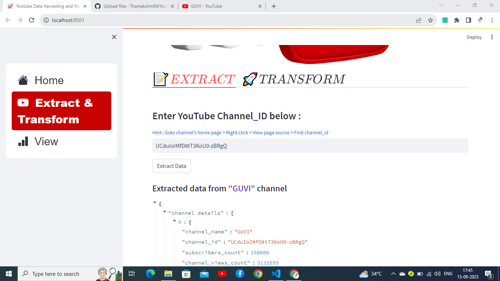

# YouTube-Data-Harvesting-and-Warehousing_using_streamlit
YouTube Data Harvesting and Warehousing using streamlit 
## Introduction 

* YouTube, the online video-sharing platform, has revolutionized the way we consume and interact with media. Launched in 2005, it has grown into a global phenomenon, serving as a hub for entertainment, education, and community engagement. With its vast user base and diverse content library, YouTube has become a powerful tool for individuals, creators, and businesses to share their stories, express themselves, and connect with audiences worldwide.

* This project extracts the particular youtube channel data by using the youtube channel id, processes the data, and stores it in the MongoDB database. It has the option to migrate the data to PSQL from MongoDB then analyse the data and give the results depending on the customer questions.

## Developer Guide 

### 1.Tools
* colab or vscode.
* Python 3.11.0 or higher.
* PSQL.
* MongoDB.
* Youtube API key.

### 2.Requirement Libraries to Install

* pip install google-api-python-client, pymongo, psql-connector-python,pypsql, pandas, streamlit.
 
### 3.Import Libraries

**Youtube API libraries**
* import googleapiclient.discovery
* from googleapiclient.discovery import build

**MongoDB & SQL connect**
* import psycopg2

**pandas**
* import pandas as pd

**Streamlit Dash board**
* import streamlit as st
* from streamlit_option_menu import option_menu

### 4. E T L Process

#### a) Extract data

* Extract the particular youtube channel data by using the youtube channel id, with the help of the youtube API developer console.

#### b) Process and Transform the data

* After the extraction process, takes the required details from the extraction data and transforms it into JSON format.

#### c) Load  data 

* After the transformation process, the JSON format data is stored in the MongoDB database, also It has the option to migrate the data to PSQL database from the MongoDB database.

### 5. E D A Process and Framework

#### a) Access PSQL DB 

* Create a connection to the PSQL server and access the specified PSQL DataBase by using pyPsql library and access tables.

#### b) Filter the data

* Filter and process the collected data from the tables depending on the given requirements by using SQL queries and transform the processed data into a DataFrame format.

#### c) Visualization 

* Finally, create a Dashboard by using Streamlit and give dropdown options on the Dashboard to the user and select a question from that menu to analyse the data and show the output in Dataframe Table and Bar chart.

## User Guide

#### Step 1. Data collection zone

* Search **channel_id**, copy and **paste on the input box** and click the **Get data and stored** button in the **Data collection zone**.

#### Step 2. Data Migrate zone

* Select the **channel name** and click the **Migrate to PSQL** button to migrate the specific channel data to the PSQL database from MongoDB in the **Data Migrate zone**.

#### Step 3. Channel Data Analysis zone

* **Select a Question** from the dropdown option you can get the **results in Dataframe format**.

